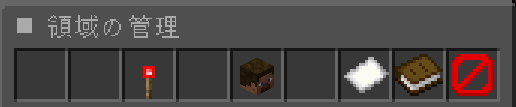
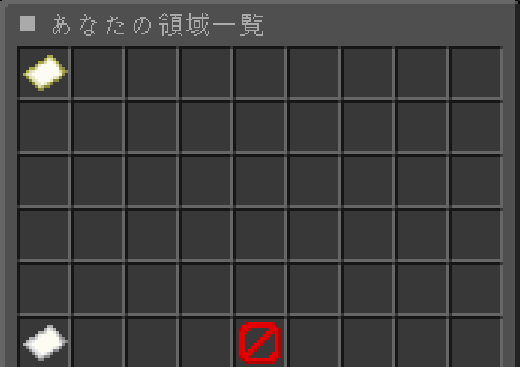

# PlayerGuard (naonao0319 fork)

WorldGuard を用いた、プレイヤー向けの土地保護プラグインです。プレイヤーが自分で範囲を保護し、メンバーやフラグを GUI から管理できます。

> このリポジトリは [TeamNekozouneko/PlayerGuard](https://github.com/TeamNekozouneko/PlayerGuard) の **fork** です。
> - fork: https://github.com/naonao0319/PlayerGuard
> - fork元: https://github.com/TeamNekozouneko/PlayerGuard
>
> 元のライセンス・著作権を尊重し、GPL-3.0 のもとで公開しています。

**PlayerGuard は再読み込みできません！ 設定変更後は再起動をしてください。**

## このforkでの主な変更点
- `/pg` の導線を整理
  - 領域内: 管理ハブGUI（フラグ/メンバー/領域情報/訪問者ログ）
  - 領域外: あなたの領域一覧GUI（座標つき）
- ロール機能を追加（主オーナー / subowner / builder）
  - 主オーナー制（譲渡/削除/subowner任免）
  - builderの期限付き貸出（自動解除）
- 訪問者ログを追加（非メンバーの入退場/破壊/設置/操作を記録）
- configで調整できる項目を追加（訪問者ログ/ロール権限）
- サブコマンドのエイリアス不具合を修正＋短縮形を追加
- GitHub Actions による自動リリースを追加

## 必要なもの
- **WorldGuard**（およびその前提である **WorldEdit**）
- Spigot / Paper 系サーバー（API 1.13 以上）

## 導入
サーバーを停止し、`plugins/` フォルダに jar を入れて起動するだけで使えます。WorldGuard・WorldEdit も同じく導入してください。

## クイックスタート
1. 金の斧で保護したい範囲を選択します。
2. `/claim` を実行して領域を作成します。
3. 作成した領域の中で `/pg` を実行し、フラグやメンバーを GUI から管理します。

## Demo

[](https://github.com/user-attachments/assets/7450c840-a21f-4111-987a-8a4f7513b290)

`/claim`、`/pg`、メンバー管理、貸出、訪問者ログ、領域一覧GUIの流れを確認できます。

### Screenshots




## 使い方

### 領域の保護
1. 範囲を選択して `/claim`（別名 `/hogo`）で保護を取得します。
2. 解除は `/disclaim`、選択のキャンセルは `/cancel` です。

### `/pg` — 管理メニュー
自分の保護領域の中で `/pg` を実行すると **管理ハブGUI** が開きます。

- **フラグ設定** … 領域内のルールを許可／拒否で切り替え（下記フラグ参照）
- **メンバー管理** … subowner/builder の一覧／追加（オンラインから選択）／操作（クリック）／建築権の貸出／領域の譲渡
- **訪問者ログ** … 非メンバーの入退場/行動ログを表示（設定で表示可否を制御可能）
- **領域情報** … ID・座標範囲・オーナー/メンバー数を表示

領域の外で `/pg` を実行すると、あなたの領域一覧GUIが開きます（座標つき）。

### ロール（主オーナー / subowner / builder）
このforkでは、領域の権限を次の3段階に分けています。

- **主オーナー** … 譲渡・領域削除・subownerの任免ができる
- **subowner** … 建築・フラグ設定・builderの追加/削除・貸出管理ができる（譲渡/削除/subowner任免は不可）
- **builder** … 建築のみ（期限付き貸出で一時的に付与される場合あり）

> subowner は「サーバー管理者（op/admin）」とは別で、あくまで“その領域の共同管理者”です。
> また、subowner に領域の譲渡や削除を許可するかは `config.yml` の `permissions` で切り替えられます。

### 訪問者ログ（visitor-log）
訪問者ログは、領域内に入った非メンバーの行動を記録し、管理ハブGUIから確認できます。

- 記録対象: デフォルトは非メンバーのみ（configで builder を含める等に変更可能）
- 記録内容: 入退場 / 破壊 / 設置 / コンテナ操作（configで個別にON/OFF可能）
- 保存: `plugins/PlayerGuard/visitor-log.yml`（定期保存＋停止時保存）
- 領域の譲渡や削除を行うと、その領域に紐づく訪問者ログと貸出情報は整理されます

### 設定できるフラグ
GUI の「フラグ設定」から、各項目を **許可 → 拒否 → 設定解除** で切り替えられます。

**1行目（基本）**
| フラグ | 内容 |
|---|---|
| ブロックの破壊 | メンバー以外のブロック破壊 |
| ブロックの設置 | メンバー以外のブロック設置 |
| アイテムの使用、チェストを開く | ボタン・チェスト・金床などの操作 |
| PvP | プレイヤー同士のダメージ |
| エンティティへのダメージ | 動物などへの攻撃 |
| メンバー以外の侵入 | 領域への立ち入り |
| ピストンの使用 | ピストン・含水葉の動作 |

**2行目（ワールド/環境）**
| フラグ | 内容 |
|---|---|
| 爆発によるダメージ | クリーパー / TNT / その他の爆発 |
| 火の延焼 | 延焼・溶岩による着火 |
| モブのスポーン | 領域内でのモブの自然湧き |
| アイテムのドロップ・拾う | アイテムの投棄・取得 |
| 環境変化 | 葉の消滅・草/キノコ/ツタ/作物の成長 |

### コマンド一覧
| コマンド | 別名 | 説明 |
|---|---|---|
| `/claim` | `/hogo` | 選択範囲を保護 |
| `/disclaim` | `/remove-hogo`, `/hogo-remove` | 保護を解除 |
| `/cancel` | `/cancel-claim` | 範囲選択をキャンセル |
| `/flags` | | フラグ設定GUIを開く（領域内） |
| `/pg` | `/guard`, `/pg` | 管理ハブGUI（領域内）/ 領域一覧GUI（領域外） |
| `/pg add <player>` | | メンバーを追加 |
| `/pg remove <player>` | `rm`, `del` | メンバーを削除 |
| `/pg transfer <player>` | `give` | 領域を譲渡（相手が `/pg confirm` で受理） |
| `/pg confirm` | `yes` | 移管リクエストを受理 |
| `/pg info` | `i` | 自分の保護情報を表示 |
| `/pg-admin` | `/pguard-admin`, `/pg-admin` | 管理者用（delete/expand/lookup/reload） |

> 領域の譲渡は、譲渡先プレイヤーに届くリクエストを相手自身が `/pg confirm` で受理して初めて完了します。受理後、その領域は譲渡先の保護量に加算されます。

### 管理者コマンド（`/pg-admin`）
別名: `/pguard-admin`, `/pg-admin`。既定で OP のみ実行可能です。

| サブコマンド | 説明 |
|---|---|
| `delete <領域ID>` | 現在いるワールドの該当IDの保護領域を1つ削除（実行後 `/pg confirm` で確定）。プレイヤー専用 |
| `expand <player> <n>` | 対象プレイヤーの保護できる総体積の上限を `n` だけ拡張 |
| `lookup [<領域ID>]` | IDを指定すると全ワールドを横断検索し、ワールド名・オーナー・座標・メンバーを表示。ID省略時は金の斧で選択した範囲の保護領域を表示 |
| `reload` | 設定（config.yml）を再読み込み |

> 領域IDは `/pg info` や WorldGuard の `/rg info` で確認できます。`delete` と `lookup` はタブ補完で領域IDの候補を表示します（`delete` は現在ワールド、`lookup` は全ワールド）。

## 設定（config.yml）
- `protection.limit` … プレイ日数に応じた保護できる総体積の上限（段階制）。キー=プレイ日数、値=その日数以降の上限。プレイ日数以下で最も近いキーが採用される。既定は 0〜7日（30000〜100000）。8日目以降は `8: 110000` のように行を追記するだけで拡張できる
- `protection.flags` … 各フラグの既定値（`false` にするとそのフラグを GUI から操作不可にできます）
- `protection.spacing` … 領域同士の最小間隔
- `visitor-log` … 訪問者ログ（有効/無効、保持件数、保存間隔、記録対象/イベント、閲覧権限）
- `permissions` … ロール関連の権限制御（例: subownerに譲渡/削除を許可するか）

### 設定例（訪問者ログ）
```yml
visitor-log:
  enabled: true
  max-entries-per-region: 100
  flush-interval-seconds: 60
  target: visitors-only
  events:
    enter-exit: true
    break: true
    place: true
    interact: true
  permissions:
    allow-subowner-view: true
    allow-builder-view: false
```

### 設定例（ロール権限）
```yml
permissions:
  allow-subowner-transfer: false
  allow-subowner-disclaim: false
```

### 記録対象の例
- `visitors-only` … 非メンバーのみを記録
- `include-builders` … 非メンバーと builder を記録
- `include-all` … 領域内の全員を記録

## ビルド
Maven でビルドできます。Minecraft 1.21 系に対応するため **JDK 21** が必要です。
```
mvn clean package
```
`target/PlayerGuard-x.x.x.jar`（shade 済み）が生成されます。

## リリース
`v` で始まるタグ（例: `v1.6.1`）を push すると、GitHub Actions が自動でビルドして Release に jar を添付します。

> `master` に push しただけでは Release workflow は動きません。リリースを作るときは `v*` タグを push してください。

## ライセンス
このプロジェクトは [GPL-3.0](LICENSE) でライセンスされています。元の著作権は [TeamNekozouneko](https://github.com/TeamNekozouneko/PlayerGuard) に帰属します。
